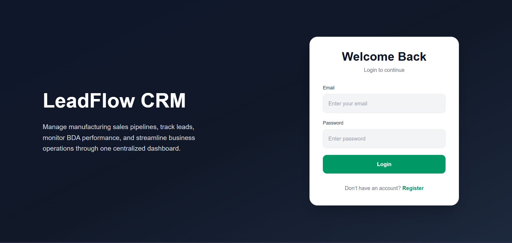
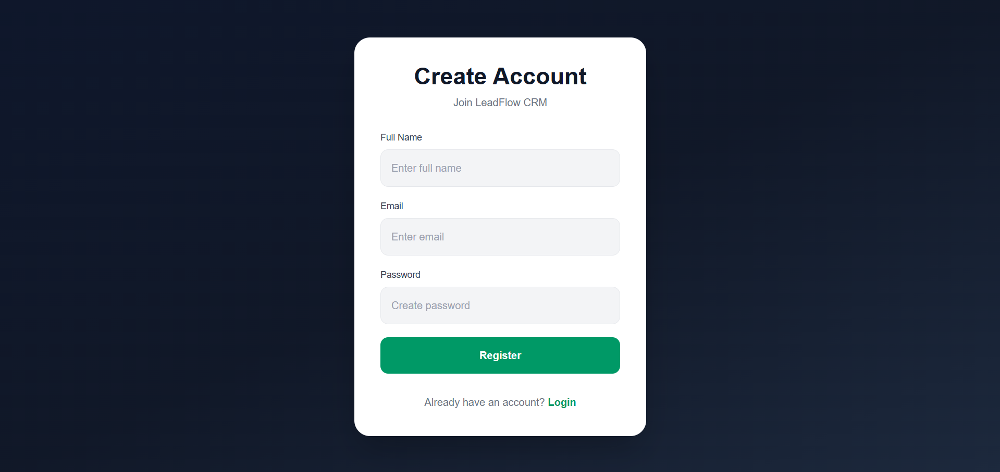
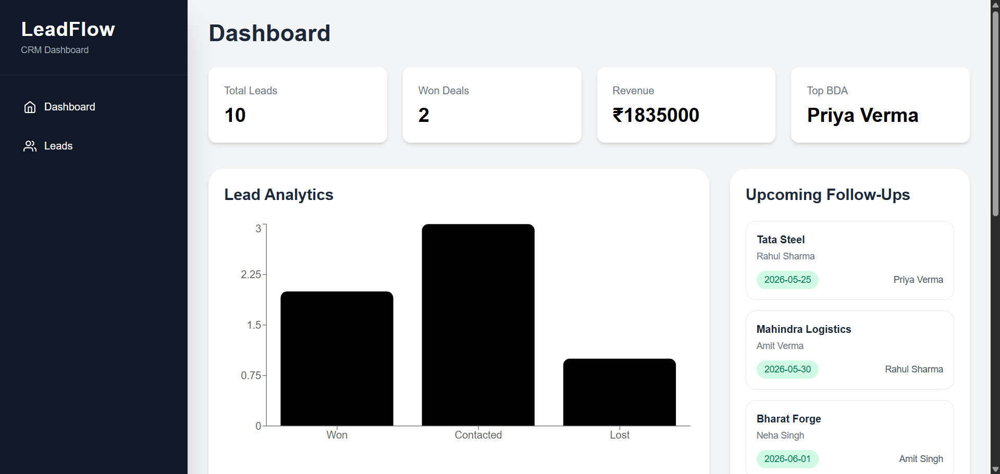
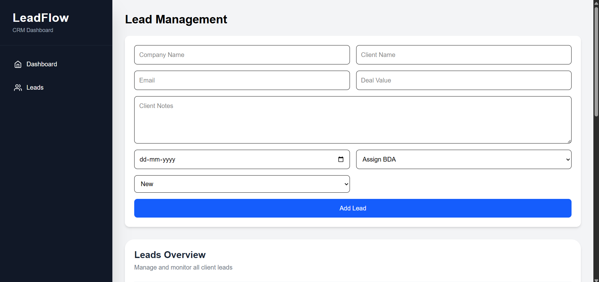
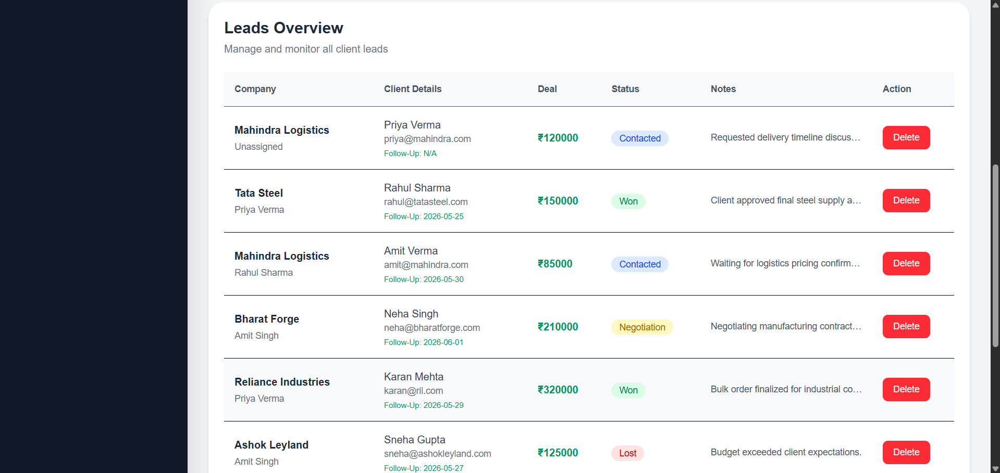

# Manufacturing CRM System

A full-stack MERN application developed for managing lead pipelines, sales tracking, client communication workflows, and BDA team performance for a manufacturing business.

---

# Features

- User Authentication (Login/Register)
- Lead Management System
- Sales Pipeline Tracking
- Client Communication Notes
- Deal Value Tracking
- Follow-Up Scheduling
- BDA Assignment System
- Dashboard Analytics
- Revenue Overview
- Top Performer Tracking
- Responsive Professional UI
- REST API Integration
- MongoDB Database Integration

---

# Screenshots

## Login Page



---

## Register Page



---

## Dashboard



---

## Leads Management



--- 

## Leads Overview



--- 

# Tech Stack

## Frontend
- React.js
- Tailwind CSS
- Axios
- Recharts
- React Router DOM

## Backend
- Node.js
- Express.js
- MongoDB
- Mongoose
- JWT Authentication
- bcrypt.js

---

# Folder Structure

```bash
project/
│
├── client/
│   ├── src/
│   ├── public/
│   └── package.json
│
├── server/
│   ├── models/
│   ├── routes/
│   ├── middleware/
│   ├── controllers/
│   └── server.js
│
└── README.md
```

---

# Environment Variables

## Backend (`server/.env`)

```env
MONGO_URI=your_mongodb_connection_string
JWT_SECRET=your_secret_key
```

## Frontend (`client/.env`)

```env
VITE_API_URL=https://leadflow-crm-tum5.onrender.com
```

---

# Installation & Setup

## Clone Repository

```bash
git clone https://github.com/Prerana43/LeadFlow-CRM.git
```

---

# Backend Setup

```bash
cd server
npm install
npm start
```

Backend runs on:

```bash
http://localhost:5000
```

---

# Frontend Setup

```bash
cd client
npm install
npm run dev
```

Frontend runs on:

```bash
http://localhost:5173
```

---

# Deployment

## Frontend
Deployed on Vercel

## Backend
Deployed on Render

## Database
MongoDB Atlas

---

# Dashboard Analytics

The dashboard includes:

- Total Leads
- Won Deals
- Revenue Analytics
- Lead Status Charts
- Upcoming Follow-Ups
- Top BDA Tracking

---

# Sample Lead Workflow

1. Add Lead
2. Assign BDA
3. Track Deal Status
4. Add Communication Notes
5. Schedule Follow-Up
6. Monitor Revenue Pipeline

---

# Future Improvements

- Edit Lead Functionality
- Advanced Filters
- Export Reports
- Notifications
- Email Integration
- Real-Time Updates

---

# Author

Developed by Prerana Nishad using MERN Stack.
